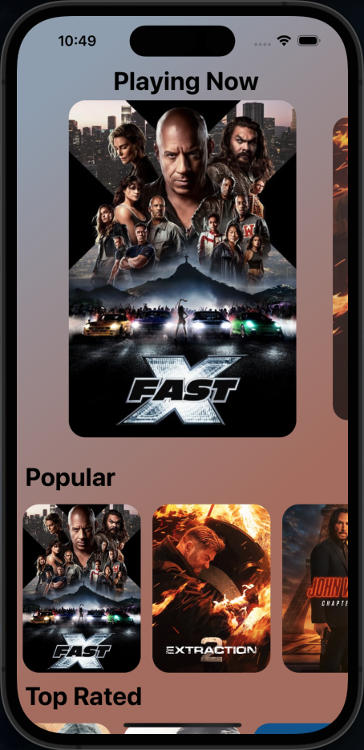

<h1 align="center">Movies App 🍿</h1>
<h2>Overview</h2>

Movies app that shows different movies based on categories like Playing now, Popular, Top Rated, Upcoming. The data is fethching from the MovieDB api.

 

<h2>Screenshot</h2>

  

## Technologies
* React Native CLI
* Typescript
