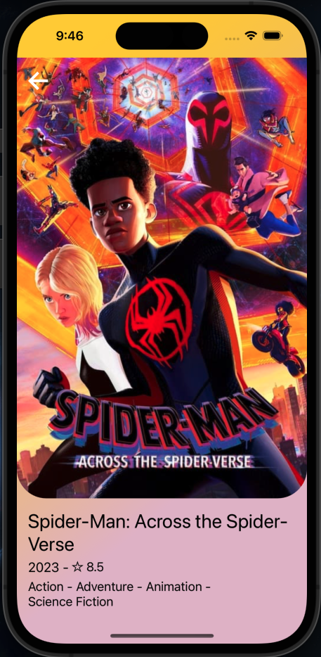
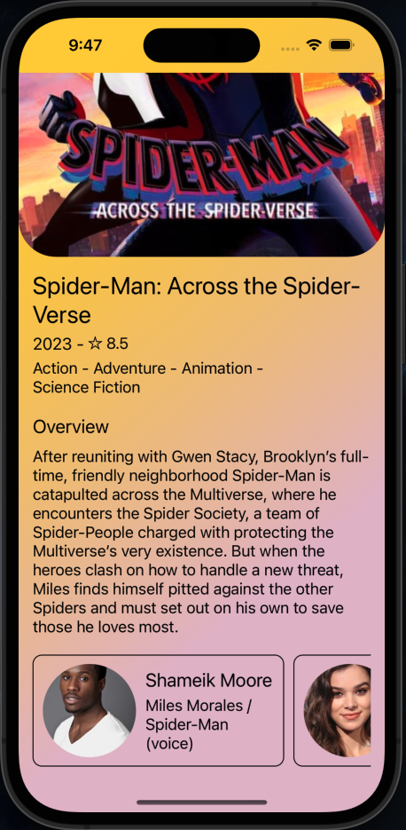

<h1 align="center">Movies App 🍿</h1>

## Overview 📘
Movies app that shows different movies based on categories like Playing now, Popular, Top Rated, Upcoming. The data is fethching from the MovieDB api.

## Scrennshots 📷
  

## Features 🕹️
- See the movies categorized
- See the details of the movie
- Background color animated based on the movie poster colors

## Technologies 💻
* React Native CLI
* Typescript

## How to use ⚙️
- Run the following commands after cloning the project
```
yarn install
npx pod-install ios
```
- The next step is run the following command to run the app on your terminal
- Make sure you have all the necessary environment setup required for running an Android or iOS simulator
```bash
yarn run ios

# you can run the app on android just replacing ios word for android  word
```
